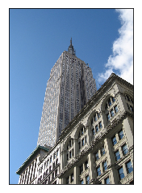
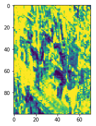

### ============================###
### Install vlfeat library using : 
conda install -c menpo cyvlfeat=0.4.5
### ============================###


```python
import cyvlfeat
dir(cyvlfeat)
```


    ['__builtins__',
     '__doc__',
     '__file__',
     '__name__',
     '__package__',
     '__path__',
     '__version__',
     '_version',
     'cyvlfeat',
     'fisher',
     'generic',
     'hog',
     'kmeans',
     'sift']


### In order to extract hog and sift feature of image : 


```python
# import the required function classes

from cyvlfeat.hog import hog
from cyvlfeat.sift import dsift,sift
```


```python
# import other requierd packages

from skimage.color import rgb2gray
import numpy as np
import matplotlib.pyplot as plt
%matplotlib inline
```


```python
# read image 
im = plt.imread('empire.jpg')
im.shape
print(480/8,640/8,31)
```

    (60, 80, 31)


```python
# show image

plt.imshow(im)
plt.xticks([]);plt.yticks([])
plt.show()

```





```python
# extracting hog features
feat = hog(im,8)
print("Output shape of HoG features of an image: {}".format(feat.shape))
```

    Output shape of HoG features of an image: (100, 71, 31)


```python
plt.imshow(np.flipud(feat[:,:,13]))
```


    <matplotlib.image.AxesImage at 0x7f4e6eacc050>





```python
# computing dense sift features of an image
fsift = dsift(rgb2gray(im))
```


```python
# dense feature points and dense descreptors of the feature points 
d_features,d_descriptors = fsift
print(" dense feature size: {}\n dense descriptor size: {}\n".format(d_features.shape, d_descriptors.shape))
```

     dense feature size: (442960, 2)
     dense descriptor size: (442960, 128)
    


```python
fsift1 = sift(rgb2gray(im),n_octaves=3,compute_descriptor=True)
```


```python
sift_features,sift_descriptors = fsift1
print(" sift feature size: {}\n sift descriptor size: {}\n".format(sift_features.shape, sift_descriptors.shape))
```

     sift feature size: (1258, 4)
     sift descriptor size: (1258, 128)
    

