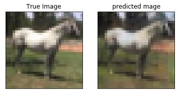
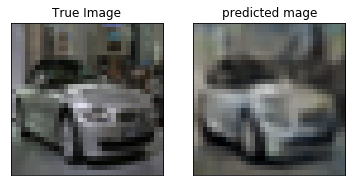
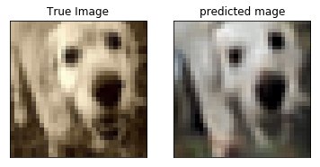

### importing required packages


```python
from keras.datasets import cifar10
from skimage.filters import gaussian
from scipy.misc import imresize
import numpy as np 
import matplotlib.pyplot as plt
%matplotlib inline
```

    Using Theano backend.


### Load the dataset


```python
(X_train,y_train),(X_test,y_test) = cifar10.load_data()
```

### loading the reconstructed image .npy files


```python
conv1 = np.load("conv1_out.npy")
conv2 = np.load("conv2_out.npy")
conv3 = np.load("conv3_out.npy")
conv4 = np.load("conv4_out.npy")
```

### display a sample image


```python
s = conv3[1].transpose(1,2,0)
plt.imshow(s)
plt.show()


```


```python
sr = imresize(s,(32, 32, 3),interp='cubic')
plt.imshow(sr)
plt.show()
```


### Displaying randomlely chosen 10 images from convolutional layer 1


```python

for i in range(10):
    n = np.random.randint(len(conv1))
    plt.subplot(1, 2, 1)
    plt.imshow(X_test[n].transpose(1,2,0))
    plt.title("True Image")
    plt.xticks([]); plt.yticks([])
    
    plt.subplot(1, 2, 2)
    plt.imshow(conv1[n].transpose(1,2,0))
    plt.title("predicted mage")
    plt.xticks([]); plt.yticks([])
    plt.show()
```





### Displaying randomlely chosen 10 images from convolutional layer 2


```python
for i in range(10):
    n = np.random.randint(len(conv2))
    plt.subplot(1, 2, 1)
    plt.imshow(X_test[n].transpose(1,2,0))
    plt.title("True Image")
    plt.subplot(1, 2, 2)
    plt.imshow(conv2[n].transpose(1,2,0))
    plt.title("predicted mage")
    plt.show()
    
```


### Displaying randomlely chosen 10 images from convolutional layer 3


```python

for i in range(10):
    n = np.random.randint(len(conv3))
    plt.subplot(1, 2, 1)
    plt.imshow(X_test[n].transpose(1,2,0))
    plt.title("True Image")
    plt.xticks([]); plt.yticks([])
    
    plt.subplot(1, 2, 2)
    plt.imshow(conv3[n].transpose(1,2,0))
    plt.title("predicted mage")
    plt.xticks([]); plt.yticks([])
    
    plt.show()
    
```








### Displaying randomlely chosen 10 images from convolutional layer 4


```python

for i in range(10):
    n = np.random.randint(len(conv4))
    plt.subplot(1, 2, 1)
    plt.imshow(X_test[n].transpose(1,2,0))
    plt.title("True Image")
    plt.xticks([]); plt.yticks([])
    
    plt.subplot(1, 2, 2)
    plt.imshow(conv4[n].transpose(1,2,0))
    plt.title("predicted mage")
    plt.xticks([]); plt.yticks([])
    
    plt.show()
```


```python

```
