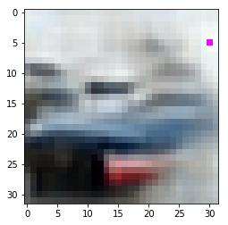

### importing required packages
```python
import numpy as np 
import matplotlib.pyplot as plt
%matplotlib inline
```

### loading .npy files
```python
conv2 = np.load("conv2_out.npy")
conv3 = np.load("conv3_out.npy")
conv4 = np.load("conv4_out.npy")
```

### example to display any particular image
```python
plt.imshow(conv3[1].transpose(1,2,0))
plt.show()
```





### Displaying randomlely chosen 10 images from convolutional layer 2
```python

for i in range(10):
    n = np.random.randint(len(conv2))
    plt.imshow(conv3[n].transpose(1,2,0))
    plt.show()
    
```


### Displaying randomlely chosen 10 images from convolutional layer 3

```python

for i in range(10):
    n = np.random.randint(len(conv3))
    plt.imshow(conv3[n].transpose(1,2,0))
    plt.show()
    
    
```


### Displaying randomlely chosen 10 images from convolutional layer 4
```python

for i in range(10):
    n = np.random.randint(len(conv4))
    plt.imshow(conv3[n].transpose(1,2,0))
    plt.show()
```


```python

```
